# Correlation of Twitter sentiments with the evolution of cryptocurrencies

## Context and goal of the project

This project is part of the Web Mining course at the HEIG-VD for the MSE HES-SO. The students realizing the project are Antoine Drabble & Sébastien Richoz.

A cryptocurrency is a controversial digital asset designed to work as a medium of exchange that uses strong cryptography to secure financial transactions, control the creation of additional units, and verify the transfer of assets. Cryptocurrencies are extremely volatile. Four years of volatility in the stock market can be covered in a month of pricing movements in the cryptocurrency markets.

Twitter is an online news and social networking service on which users post and interact with messages known as "tweets". It is also the primary channel of communication for cryptocurrencies. Many important news are relayed (retweeted) by thousands of user and can reach a very large audience. For example, John McAfee, who has 828'338 followers at the moment, is a famous cryptocurrency user. His tweets can affect the course of a cryptocurrency up to more than 100% due to his huge audience. There are many other influential Twitter users.

The goal of this project is to propose a tool to visualize the correlation between cryptocurrencies' price in USD and a score based on the sentiment analysis of tweets, the number of followers of the user, the number of retweets and the number of likes.

In the first part we will make an historical analysis of the correlation.

In the second part we will propose a tool for the realtime visualisation of the evolution of tweets scores with cryptocurrency's price in USD.

## Planification and work distribution

Here are the steps/milestones of the project:

1. Retrieval of the tweets from the Twitter API.
2. Retrieval of the cryptocurrencies change to USD historical data by interval of 1 minute from the cryptocompare API.
3. Sentiment analysis of the tweets using the VADER algorithm.
4. Computation of a score based on the sentiment, the number of likes, the number of tweets in a time range and the number of followers of the person who tweeted.
5. Computation and visualisation of a cross-correlation score with different lag values between the tweets scores and the cryptocurrency's change in USD.
6. Creation of a real-time visualisation tool of the correlation between the tweets and cryptocurrency's change.
7. This step is optional and not implemented yet. This step's goal is to train a recurrent nural network (LSTM or GRU) to predict the currency of the bitcoin based on the tweets scores and the cryptocurrenciy's change. And automate the purchase and the sale of the cryptocurrency with the trained network.

Below is the list of the task that each member of the team worked the most on. Note that we worked together on many tasks and on the analysis of the problems.

Antoine:
- Extraction/Preprocessing of tweets
- Cross-correlation analysis

Sébastien.
- Extraction of the currencies
- Real-time correlation viewer

## Data sources and quantity

Two data sources where needed to retrieve the information: one for the tweets and one for the cryptocurrency.

### Twitter

The Twitter API is the source for all the tweets. It is limited to 450 requests of maximum 100 tweets per 15 minutes with the App login. It can only retrieve tweets 7 days old at most. We have retrieved around 20 days of tweets which represent ~1'120'000 tweets for the Bitcoin (BTC). We also retrieved around 10 days for two other cryptocurrencies. ~2500 tweets for Nexo (NEXO) and 15'000 for Zilliqa (ZIL).

To make searches in the Twitter API you must use the query operators to match on multiple keywords. Here is an example of a query for the Bitcoin related tweets.
- bitcoin OR #BTC OR #bitcoin OR $BTC OR $bitcoin

For each tweets we extracted the following informations:
- ID
- Text
- Username
- Number of followers of the user
- Number of retweets
- Number of likes
- Creation date

At this step we also filtered the non english tweets by specifying it to the Twitter API.

### Cryptocurrencies

Bitcoin is a cryptocurrency and worldwide payment system. It is the first decentralized digital currency, as the system works without a central bank or single administrator. The system was designed to work as a peer-to-peer network, a network in which transactions take place between users directly, without an intermediary. The Bitcoin currently has a market cap of 28'256'866'432 and a price of ~7500$ for 1 Bitcoin making it the largest cryptocurrency in the world.

Zilliqa is the next generation, high throughput blockchain platform, designed to scale, using sharding technology which allows transaction rates to increase as the network expands which will scale with an increase of miners. It was introduced the 27th of december 2017.

Nexo a lending Platform platform for the world’s first instant crypto-backed loans, which gives investors and businesses access to instant cash, while retaining ownership of their digital assets and thus keeping all upside potential – a much needed service by the crypto community. It was introduced the 27th of february 2018.

The API CryptoCompare (https://min-api.cryptocompare.com/) was used to retrieve the crypto currencies that we analyzed. Different endpoints are available to retrieve historical data every minute up until 7 days, after what we can retrieve currencies hourly or daily.

About 150 crypto currencies are available from the CryptoCompare API. We focused on Bitcoin, Zilliqa and Nexo as a starting point. The data retrieved contains the following fields:

- time: when the data was emitted
- close: the price at the end of the time frame (minutely, hourly or daily depending the targeted endpoint)
- high: the highest price reached during the time frame
- low: the lowest price reached during the time frame
- open: the price at the opening of the time frame

The smallest time unit we have is every minute. We didn't find any free API that offers smaller time units like every second even if we considered some others like Binance/Coinbase/Bitstamp/Kraken/ITBIT. However we found csv files on this platform (https://www.cryptodatasets.com/platforms/Bitfinex/BTC/) but at the time we visited the website, there were not updated recently enough to match the retrieved tweets.

With the CryptoCompare API we were able to retrieve currencies minutely for the three different cryptos:

- Bitcoin : 11.05.18 - 06.06.18
- Zilliqa : 18.05.18 - 06.06.18
- Nexo : 22.05.18 - 06.06.18

Even if we have the currencies grouped minutely with an OHLCV (Open High Low Close Volume) system, it is sufficient to use the closing price to study the correlation.

## Preprocessing

For the preprocessing, we remove all of the useless data from the tweets, such as HTTP links, @pseudo tags, images, videos and hashtags (#happy->happy).
We finally stored them in a CSV file. These files are located in `/data/twitter/<CurrencySymbol>/<CurrencyName>_tweets_clean.csv`.

Once the cleaned files are obtained, we process the sentiment analysis on each textual content of the tweet to obtain a sentiment score named compound. This compound is then multiplied by the number of followers of the user and the number of likes to emphasize the importance of the sentiment. Here is the calculation made on the compound to obtain the tweet's score:

tweet's score = (#like + #follower) * compound

 If the tweet comes from an influencer, the number of followers will be high, so the score will be. If it is retweeted by a lambda person with a dozen of followers, the score will be small. We don't consider the number of retweet because it is the same for the original tweet and for any of its retweet: we don't want that a lambda person could have an impact on the score by considering the number of retweet in the tweet's score calculation.

 Finally, after the tweets have been fully processed, we end up with two features:
 1. the creation date of the tweet
 2. the score of the tweet where a negative value indicates a bad sentiment, a positive a good sentiment and a zero indicates a neutral sentiment.

## Techniques and algorithms

In this section are listed the techniques and algorithms we used to find a correlation and to analyze the sentiments of the tweets.

### Cross-correlation analysis

Applying a correlation on the series (tweets' scores and crypto currency) is not enough. That's why we need cross-correlation. The difference is that cross-correlation adds a lag which permit to shift one of the timeseries left or right to find, maybe, a better correlation. This is coherent with our problem as the currency changes come after the tweets' sentiments. So we are fully allowed to operate it.

Now the correlation's method we use can be either Pearson, Kendall or Spearman. We tried all of them and their are pretty equivalent. However Spearman obtains globally better results because it is able to correlate on linear and non-linear data.

### Sentiment analysis - vaderSentiment

For the analysis of the sentiment we use the VADER algorithm. There is a great implementation in Python called vaderSentiment. https://github.com/cjhutto/vaderSentiment.

Here is a description of the 3 sentiment analysis algorithms that we considered.

#### Polarity classification
Since the rise of social media, a large part of the current research has been focused on classifying natural language as either positive or negative sentiment. Polarity classification have been found to achieve high accuracy in predicting change or trends in public sentiment, for a myriad of domains (e.g. stock price prediction).

#### Lexicon-based approach
A lexicon is a collection of features (e.g. words and their sentiment classification). The lexicon-based approach is a common method used in sentiment analysis where a piece of text is compared to a lexicon and attributed sentiment classifications. Lexicons can be complex to create, but once created require little resources to use. Well designed lexicons can achieve a high accuracy and are held in high regard in the scientific community.

#### VADER
Valence Aware Dictionary and sEntiment Reasoner (VADER) is a combined lexicon and rule-based sentiment analytic software, developed by Hutto and Gilbert. VADER is capable of both detecting the polarity (positive, neutral, negative) and the sentiment intensity in text. The authors have published the lexicon and python specific module under an MIT License, thus it is considered open source and free to use.

The VADER algorithm uses negations et contractions (not good, wasn’t good), ponctuation (good!!!), capital letters, emotes :), emojis,
intensificators (very, kind of), acronyms (lol) and other factors to calculate the scores. It outputs a compound score between -1 (negative) and 1 (positive).

## Tools and libraries

### Python

We have used the Python programming language for this project in version 3.6.

### Jupyter notebooks

Jupyter Notebook (formerly IPython Notebooks) is a web-based interactive computational environment for creating, executing, and visualizing Jupyter notebooks. We have used it to structure, document and execute/visualise our code.

### Pandas

Pandas is the library we have used the most. It proposes useful functions to read data from our csv files, to write to them, to create and make mathematical operations on dataframes and time series. We have used it for the cross-correlation analysis.

### Twython

Twython is a library used to interact with the Twitter API. It proposes useful functions login and make queries on the API.

### Matplotlib

We have used this library for most of our plots.

### Plotly

Plotly is another library used for plots.

### tqdm

We have used tqdm to show progress bars for long running operations, such a retrieval of the tweets from the Python API and the preprocessing of the tweets. It took around 14 hours to preprocess the tweets but then we switched to a multi-threaded method which didn't support tqdm.

### Numpy

NumPy is a library for the Python programming language, adding support for large, multi-dimensional arrays and matrices, along with a large collection of high-level mathematical functions to operate on these arrays. We used numpy for some of the operations on the dataframes.

### Other libraries

We have used many other small Python libraries which can be found in the Jupyter notebooks at the root of this project.

## Functionnalities / Use cases

The purpose of this project is to see the tweets' sentiments with the evolution of the crypto currency on a real time graph to decide wether to invest in the crypto or to sell it, based on sentiment emitted from tweets. So we built a realtime graph streaming the CryptoCompare API and the tweets which plots the sentiment score and the currency every time it receives new data.

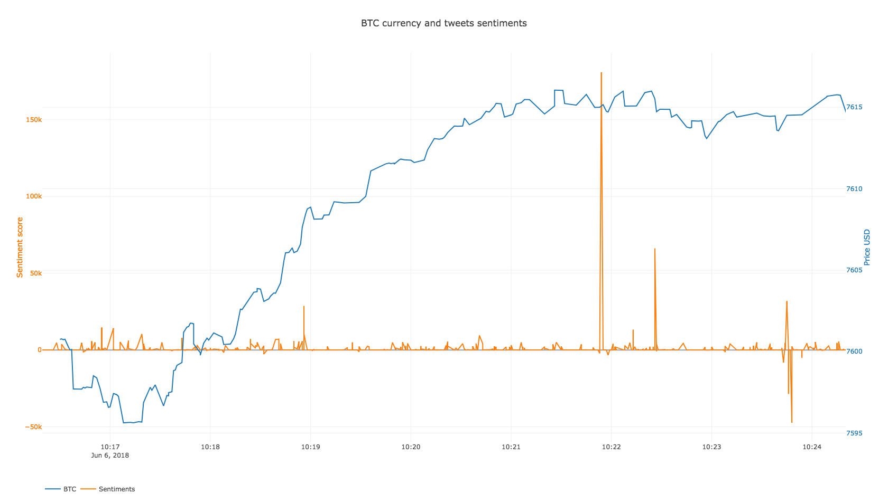

When a tweet is received, the same pipeline is applied:
1. Extract creation date, textual content, number of followers and likes
2. Clean the textual content from http links, pseudo, images and videos
3. Compute its sentiment's compound with VADER
4. Compute the final sentiment's score with the number of followers and likes
5. Plot it on the realtime graph

After 10 minutes, we received about 1000 tweets and 150 crypto currency updates.

An additional functionality is to plot the prediction as well in order to help the user in crypto placement. We didn't have time to do this part but we would do it by building a neural network made of LSTM (Long Short Term Memory) cells, train it with the historical data and use new incoming data for prediction.

## Analysis of the results

As a starting point we analyzed the **Bitcoin**. The correlation between tweets and cryptocurrencies is calculated on the derivative of tweets and cryptocurrency because we want to correlate the increase or decrease of the crypto. So when the derivative of crypto currency is a peak, it means that the increase is maximum. When it's flat, it means the crypto has stabilized. Here is the graph of tweets' and crypto's:

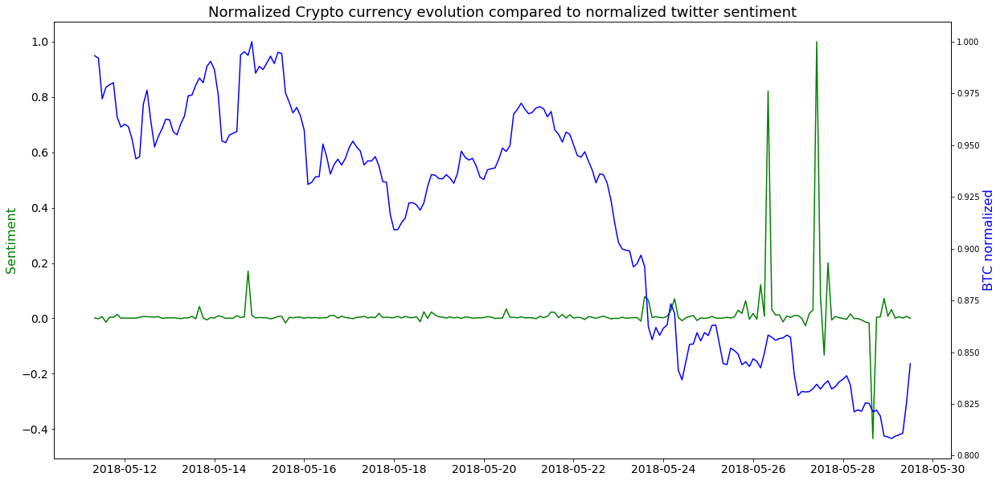

and here is its derivative:

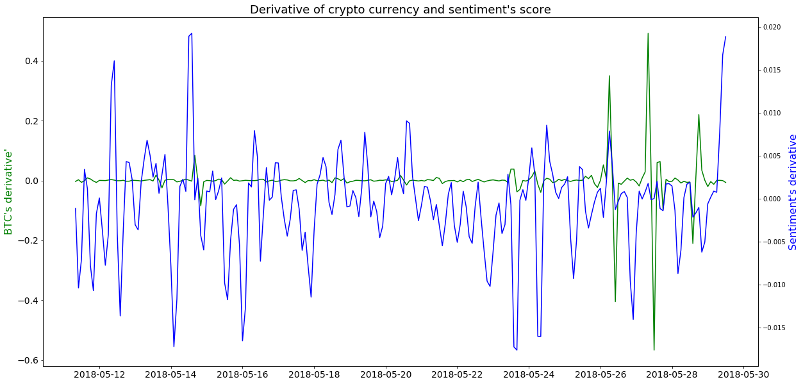

It is hard to see a correlation. At  first sight we see that crypto's derivative has a large amplitude compared to the sentiment's one. Few peaks seem matching at the end but those are outliers and we can't define a rule from these impressions.

That's why we computed the correlation using panda's dataframe built in method `corr` (http://pandas.pydata.org/pandas-docs/version/0.22/generated/pandas.DataFrame.corr.html) which let us choose between Pearson, Kendall and Spearman's correlation. As we are working with time series and crypto currencies, we should add a lag parameter to shift one of the series left or right in order to expect a higher correlation. This is called cross-correlation.

On the following plot, we varied lag between -20 and +20 and as the data is grouped by 2h, it means means that the sentiment series is switched between -40 and +40 hours.

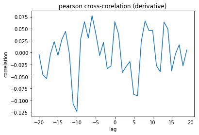
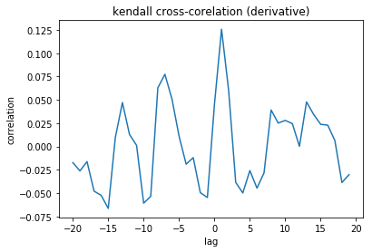
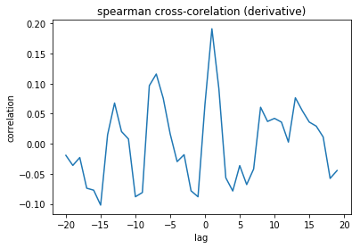

A correlation of +1 or -1 means that both sentiment and crypto derivatives are matching and we can therefore use it as a predictive mechanism. A correlation of 0 means that there is absolutely no match.

Kendall and Spearman look pretty the same but the best score is obtained with spearman: 0.2 at a lag of 1. However, the results are meaningless, the correlation is way too low to infer any prediction.

From Wikipedia https://en.wikipedia.org/wiki/Spearman%27s_rank_correlation_coefficient:
*The Spearman correlation between two variables is equal to the Pearson correlation between the rank values of those two variables; while Pearson's correlation assesses linear relationships, Spearman's correlation assesses monotonic relationships (whether linear or not).*

We therefore think that Spearman is more suited for timeseries data where the relationships are not linear.

### What about other crypto currencies ?

The fact that we obtain such a bad correlation comes maybe from the high popularity of the crypto currency. The Bitcoin is very popular and twitter sentiments may not be the only element to influence its currency. So we tested with two other less known crypto: NEXO and Zilliqa.

For both these cryptos we processed the same pipeline to find a correlation.

#### NEXO

Some tweets are missing but the whole graph is still ploted to see if the positive sentiment on 27th may has an impact on the nexo currency.
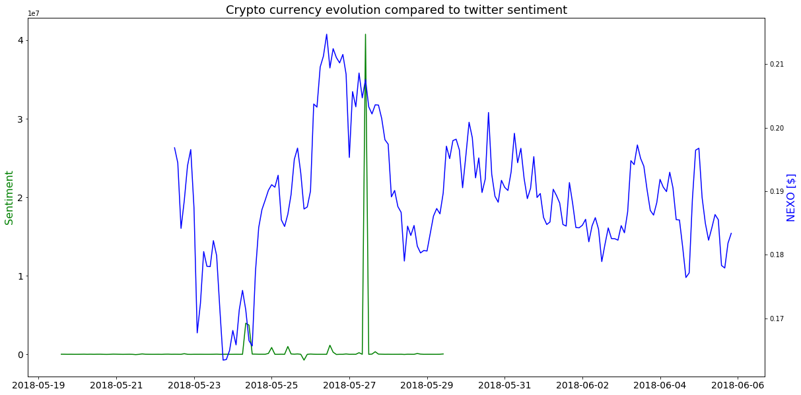

For the derivative, the timeseries are croped
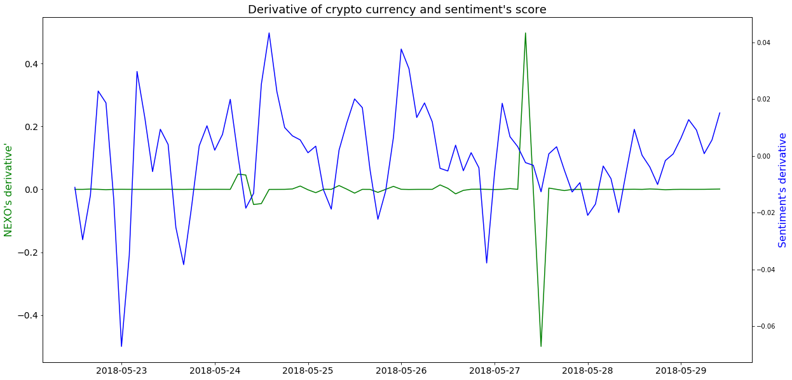
Again, we can't say much just by observing the shape of these graphs.

With the spearman cross-corelation we obtain the best correlation score of 0.3 at a laf of 10.
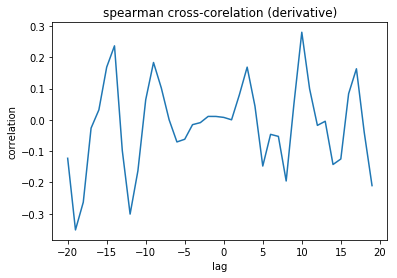

#### Zilliqa

On this plot it looks like positive sentiments make the currency decrease. An interesting rule to gain money would be to do the contrary of what people think.
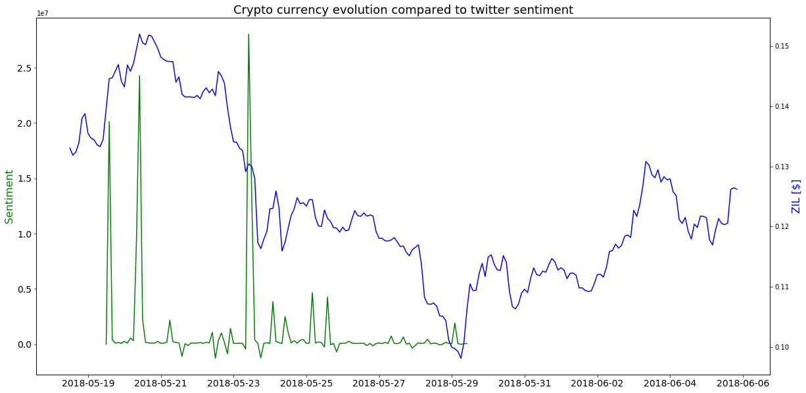

The derivative seems more correlated than the other cryptos
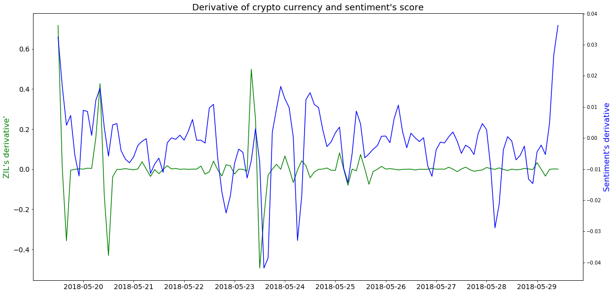

Indeed, we obtain a score of 0.3 at a lag of 0.
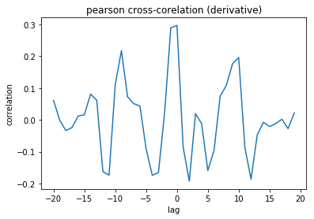

#### Comparison

If we compare the 3 graphs of the different cryptocurrencies (image below) we can observe that most of the time, in each currency, when there is a big spike of Twitter sentiment, the currency drops. That is maybe caused by people seeing the hype and so they decide to sell. In fewer cases, we observed that the price increases when there is a negative Twitter sentiment. A LSTM might be able to make use of those large spikes to decide when to sell.

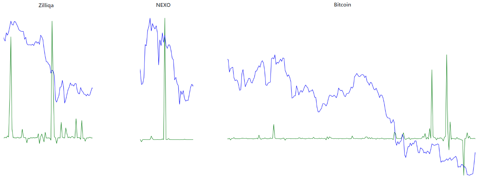

## Discussion

Still these two other cryptos don't give meaningfull correlations. It is very hard to predict the crypto currency based on twitter sentiments. Other factors influence the crypto but we don't know them (if we do, we would already be rich). A further analysis could be to study a correlation on more historical data, going maybe up to 6 months back, even 1 year.

Another improvement could be to focus on a bigger time frame to make prediction. Here we chose to group the scores and crypto currencies by 2 hours. Maybe doing it every 12 hours or every day could increase the chance of observing a correlation, though the cryptos are very volatile.

## Conclusion

The project was very interesting but we had a limited amount of time to achieve it. We couldn't implement the machine learning step with Keras as we would have liked to do and didn't have the time (due to Twitter limitations) to get a large enough sample of tweets.
There is not a clear correlation between the two series. We have observed that when a good sentiment score appears, right after the Bitcoin decreases or increases. We are not able to predict it either with the cross-correlation analysis. A recurrent neural network could make use of the elements that correlate to do better predictions after tuning well its hyperparameters but we can't know for sure and keep it a further improvement.
The Jupyter notebooks with Python and all of the libraries available for Python were very useful and adapted for this project.

## Annex

### Bibliography

Cryptocurrencies on Wikipedia
https://en.wikipedia.org/wiki/Cryptocurrency

Travail de bachelor sur le sujet
http://www.diva-portal.org/smash/get/diva2:1110776/FULLTEXT01.pdf

Site qui affiche des scores basés sur les réseaux sociaux
https://solume.io/?sorting=socialVolumeChange&direction=asc

Correlation analysis on cryptocurrencies
https://blog.patricktriest.com/analyzing-cryptocurrencies-python/

One more paper
https://www.ncbi.nlm.nih.gov/pmc/articles/PMC4988639/

List of crypto experts on twitter
https://www.fnlondon.com/articles/the-bitcoin-and-cryptocurrency-experts-to-follow-on-twitter-20171211?mod=topStories

McAfee influencing cryptocurrencies with single tweets
https://motherboard.vice.com/en_us/article/9knnpz/john-mcafee-twitter-coin-of-the-day-cryptocurrency-markets

Bitcoin Spread Prediction Using Social And Web Search Media
https://pdfs.semanticscholar.org/1345/a50edee28418900e2c1a4292ccc51138e1eb.pdf

VADER Sentiment analysis of social media text
http://comp.social.gatech.edu/papers/icwsm14.vader.hutto.pdf
https://github.com/cjhutto/vaderSentiment

Google news which caused the Bitcoin's price to drop, the information was most likely retweeted.
https://www.cnbc.com/2018/03/14/bitcoin-falls-below-9000-after-google-bans-cryptocurrency-ads.html

API for Bitcoin currency
https://www.cryptodatasets.com/platforms/Bitfinex/BTC/

Cross correlation analysis of tweets
https://stackoverflow.com/questions/33171413/cross-correlation-time-lag-correlation-with-pandas
https://pandas.pydata.org/pandas-docs/version/0.21/generated/pandas.Series.autocorr.html

Basic actions on time series
https://chrisalbon.com/python/data_wrangling/pandas_time_series_basics/

Twitter seach operators https://lifehacker.com/search-twitter-more-efficiently-with-these-search-opera-1598165519

### Setup
- Install anaconda with Jupyter version TODO, create a python 3.6 environment. Run `pip install .` in the root of the folder to install all the requirements from the `requirement.txt` file. Finally open the notebooks in Jupyter to run them.
- To execute the js script, please rename `streamer/.env-sample` into `streamer/.env` and edit the file with your plotly configuration.

### Indications
- `data/crypto/var_crypto.csv` contains variables to retrieve historical data. Please do not touch this file.

### Authors
- Antoine Drabble
- Sébastien Richoz
